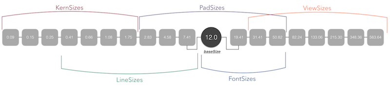

## What?
An open source framework for helping developer's/engineer's (or really anyone) build beautiful UI's.

## Why?
*GoldKit* was created to remove the difficulty in creating beautiful UI's.  As a developer building a good UI is many times left until last, and other times overlooked completely.  *GoldKit* hopes to help you remove the difficulty in design and make sure it gets done.

## How?
Using the golden ratio we calculate the sizes for a range of different UI elements that are required when creating a diverse and attractive interface.



As the image above shows, there are 5 different ``enum`` size ranges we currently use:

* ``ViewSizes`` - for large elements and container elements
* ``PadSizes`` - for padding and margin sizes
* ``FontSizes`` - for font sizes 
* ``LineSizes`` - for small sizes, like lines
* ``KernSizes`` - for very small sizes, like letter spacing

Each one of the above ``enum``'s gives access to there sizes through pre-defined ``case``'s, ``xxSmall`` to ``xxLarge``, dependent upon which size ``enum`` is used.

## Usage

### Accessing GoldKit
All interaction with *GoldKit* occurs through the ``GoldKit`` singleton class.  We dont want to re-calculate our sizes every time, so access the ``GoldKit`` class through the ``main`` instance.

```swift
let goldKit = GoldKit.main
```

### Overriding Base Size
On the first time we access the signleton instance our calculations are made.  We use the ``baseSize = 12.0`` to make our calculations, and this serves as the smallest font size.  You can override the ``baseSize``, just remember to call the ``calculate()`` method after.

```swift
...
goldKit.baseSize = 13.0
goldKit.calculate()
```

### Getting Sizes
To access a size just call one of the public methods, passing in a predefined size ``enum`` for the given method.

```swift
...
let viewSize = goldKit.viewSize(.large)
// viewSize returns a Double value
// given the baseSize of 12.0, viewSize is 215.30...
```
Predefined size ``enum``'s are between ``xxSmall`` and ``xxLarge`` depending on the element sizes needed. Xcode's autocomplete will help with seeing what sizes are available.

### UI Elements

*GoldKit* provides a higher level api (more to come) for creating necessary UI elements with the underlying sizes:

```swift
let font = goldKit.font(.medium)
// this will create a UIFont instance w/size 19.41
// (with the default font family)
```

## Pre-Release Version
This is a pre-release version of *GoldKit* and although it is stable and should be working in all the above cases, things will be added, changed and potentially break.

## License
*GoldKit* is released under an **MIT** license.  So use it how ever you want.
