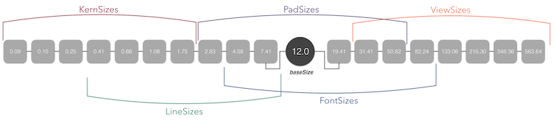

## What?
An open source framework for helping developer's/engineer's (or really anyone) build beautiful UI's.

## Why?
*GoldKit* was created to remove the difficulty in creating beautiful UI's.  As a developer building a good UI is many times left until last, and other times overlooked completely.  *GoldKit* hopes to help you remove the difficulty in design and make sure it gets done.

## How?
Using the golden ratio we calculate the sizes for a range of different UI elements that are required when creating a diverse and attractive interface.



As the image above shows, there are 5 different ``Element`` types that we can work with, represented by an ``enum``:

```swift
public enum Element {
    case view
    case pad
    case font
    case line
    case kern
    
    ...
}
```

* ``.view`` - for large elements and container elements
* ``.pad`` - for padding and margin sizes
* ``.font`` - for font sizes 
* ``.line`` - for small sizes, like lines
* ``.kern`` - for very small sizes, like letter spacing

Coupled with the ``Element``, we can use the ``Size`` ``enum`` to define what size of an ``Element`` we are going to use:

```swift
public enum Size: Int {
    case xxSmall = 0
    case xSmall = 1
    case small = 2
    case medium = 3
    case large = 4
    case xLarge = 5
    case xxLarge = 6
    
    ...
}
```
The sizes above are pretty self explanitory, just note that some of the sizes might note be practical for every use.  Play around with them and don't be affraid to combine multiple sizes together to get the size you need.  *The box does not exist!*

## Usage

### Accessing GoldKit
All interaction with *GoldKit* occurs through the ``GoldKit`` singleton class.  We dont want to re-calculate our sizes every time, so access the ``GoldKit`` class through the ``main`` instance.

```swift
let goldKit = GoldKit.main
```

### Overriding Base Size
On the first time we access the signleton instance our calculations are made.  We use the ``baseSize = 12.0`` to make our calculations, and this serves as the smallest font size.  You can override the ``baseSize``, just remember to call the ``calculate()`` method after.

```swift
...
goldKit.baseSize = 13.0
goldKit.calculate()
```

### Accessing Sizes
To access a size just call the ``.size(_ size:Size, element:Element)`` method, passing in a predefined ``Size`` and ``Element`` ``enums``.

```swift
...
let viewSize = goldKit.size(.large, element:.view)
// given the baseSize of 12.0, viewSize is 215.30...
```

### UI Elements

*GoldKit* provides a higher level api (more to come) for creating necessary UI elements with the underlying sizes:

```swift
let font = goldKit.font(.medium)
// this will create a UIFont instance w/size 19.41...
// (with the default font family)
```

## Pre-Release Version
This is a pre-release version of *GoldKit* and although it is stable and should be working in all the above cases, things will be added, changed and potentially break.

## License
*GoldKit* is released under an **MIT** license.  So use it how ever you want.
